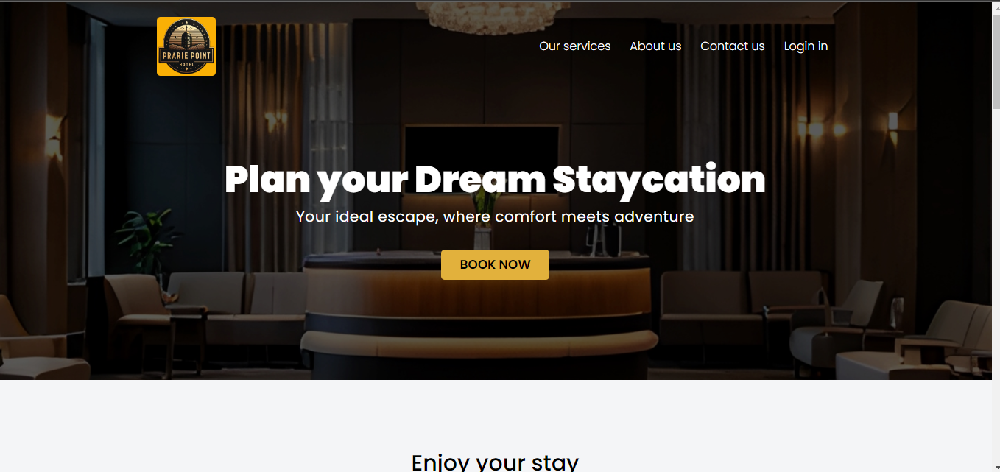
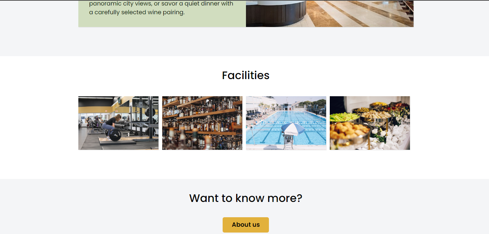

# Prairie Point Hotel - HTML/CSS Website Template
Prairie Point Hotel is a responsive website template built with HTML and CSS, designed for hotel businesses. It offers a clean, modern layout optimized for showcasing hotel services, rooms, and amenities. 

## Features
- Responsive design suitable for desktop, tablet, and mobile devices
- Structured HTML for easy content management and CSS-based layout with a modern, clean design
- Simple navigation and a user-friendly interface

## Screenshots

## Technologies Used
- **HTML**: Used to create the structure and content of the website.
- **CSS**: Used to design the layout, styles, and responsiveness of the website.

## Live Demo

You can view the live version of the Prairie Point Hotel website here: [Live Site](https://davidnwachukwu2005.github.io/prairie-point-hotel/)

## Contact
For any inquiries, you can reach me at [davidike444@gmail.com].